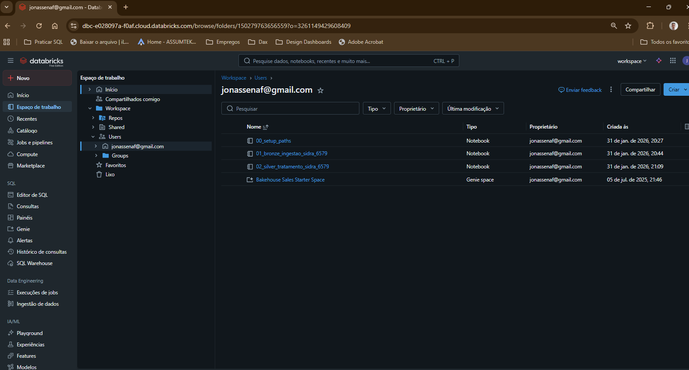
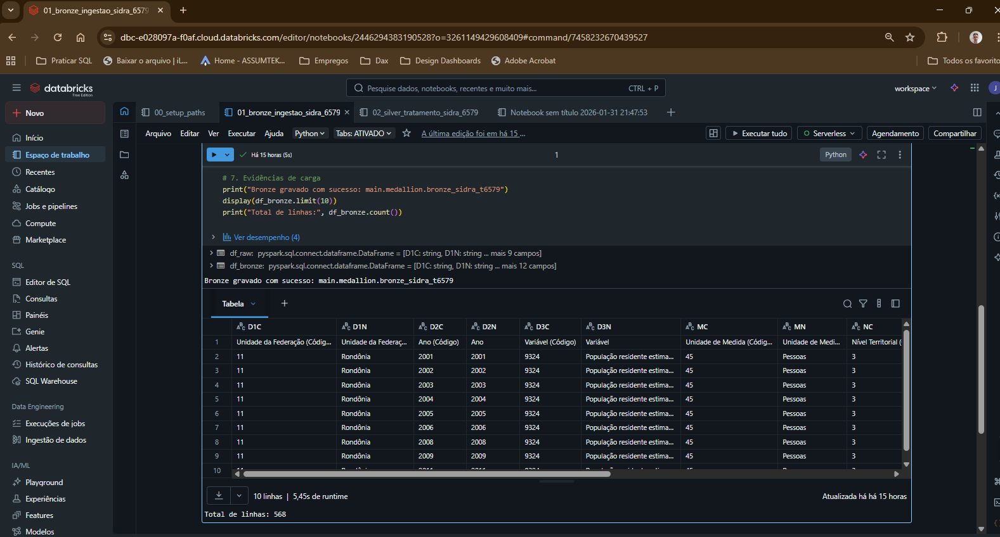
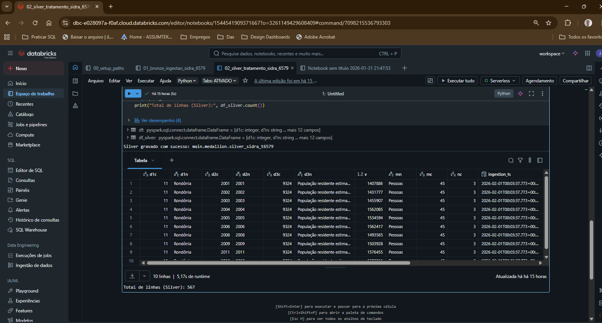
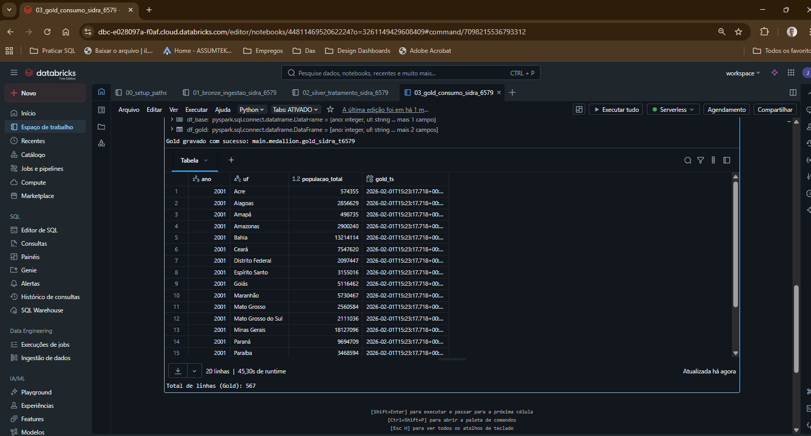

# IBGE SIDRA – Medallion Pipeline (Databricks)

Pipeline de dados analítico desenvolvido a partir da API pública do <strong>IBGE SIDRA (Tabela 6579 – População residente estimada)</strong>, utilizando <strong>Databricks Free Edition</strong> e seguindo a <strong>arquitetura Medalhão (Bronze, Silver e Gold)</strong>.

O objetivo do projeto é demonstrar boas práticas de engenharia de dados para ingestão, tratamento e disponibilização de dados com foco em consumo analítico, clareza de grão, reprocessamento controlado e organização para ferramentas de BI.

## Tecnologias Utilizadas

- Databricks (Free Edition)
- Apache Spark (PySpark)
- Delta Lake
- Python
- API pública IBGE SIDRA

## Fonte de Dados

- <strong>Origem:</strong> API pública do IBGE SIDRA  
- <strong>Tabela:</strong> 6579 – População residente estimada  
- <strong>Endpoint:</strong> https://apisidra.ibge.gov.br/values/t/6579/n3/all/p/all/v/all

## Arquitetura da Solução

O pipeline foi implementado seguindo o padrão <strong>Arquitetura Medalhão</strong>, separando claramente as responsabilidades de cada camada de dados.

### Bronze – Ingestão Bruta
- Consumo direto da API pública do IBGE SIDRA.
- Armazenamento dos dados sem transformação de negócio.
- Inclusão de metadados técnicos:
  - ingestion_ts
  - source
  - source_url
- Camada reprocessável, utilizando estratégia de DROP TABLE + overwrite.

### Silver – Tratamento e Qualidade
- Tipagem adequada das colunas (inteiros, strings e valores numéricos).
- Padronização e renomeação de campos para facilitar leitura e uso analítico.
- Remoção de registros inválidos e inconsistências.
- Organização lógica das colunas.
- Camada reprocessável.

### Gold – Consumo Analítico
- Agregação dos dados por:
  - Ano
  - Unidade da Federação (UF)
- Métrica principal:
  - populacao_total
- Tabela final pronta para consumo por ferramentas de BI.
- Inclusão de metadado de carga (gold_ts).

A camada Gold foi projetada para permitir consumo direto por ferramentas de Business Intelligence, tais como Power BI, Tableau e Databricks SQL, viabilizando análises exploratórias, dashboards gerenciais e estudos analíticos.

## Decisões de Arquitetura

- <strong>Arquitetura Medalhão:</strong> adotada para separar responsabilidades, facilitar manutenção, auditoria e evolução do pipeline.
- <strong>Reprocessamento explícito:</strong> todas as camadas utilizam estratégia reprocessável (DROP + overwrite), adequada ao caráter histórico da fonte pública.
- <strong>Bronze sem regras de negócio:</strong> preserva fidelidade à fonte e garante rastreabilidade.
- <strong>Silver com foco em qualidade:</strong> concentra tipagem, padronização e consistência dos dados.
- <strong>Gold orientada a consumo:</strong> entrega dados agregados e prontos para análise, reduzindo complexidade para usuários finais.
- <strong>Delta Lake:</strong> utilizado para garantir consistência, confiabilidade e organização das tabelas analíticas.

## Estrutura do Repositório

`
ibge-sidra-medallion-pipeline/
  notebooks/
    00_setup_paths.ipynb
    01_bronze_ingestao_sidra_6579.ipynb
    02_silver_tratamento_sidra_6579.ipynb
    03_gold_consumo_sidra_6579.ipynb
  images/
    workspace.png
    bronze.png
    silver.png
    gold.png
  README.md
`

## Evidências da Arquitetura Medalhão

A criação da arquitetura medalhão é evidenciada por:

### Organização do Workspace
Workspace Databricks organizado por notebooks, refletindo claramente as etapas da arquitetura medalhão.

### Bronze – Ingestão Bruta
Dados ingeridos diretamente da API pública do IBGE SIDRA, preservando o formato original e incluindo metadados técnicos.

### Silver – Tratamento e Qualidade
Dados tratados, tipados e padronizados, removendo inconsistências e preparando a base para consumo analítico.

### Gold – Consumo Analítico
Tabela final agregada por ano e Unidade da Federação, pronta para consumo em ferramentas de BI.

## Considerações Finais

Este projeto demonstra um pipeline de dados completo, partindo de uma fonte pública via API até a disponibilização de dados prontos para consumo analítico, aplicando boas práticas de engenharia de dados, arquitetura medalhão e uso de tecnologias modernas de processamento distribuído.
